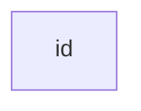

# H1
## H2
### H3
#### H4
##### H5
###### H6

Párrafo cualquiera

Si queremos poner en **negrita**

Si queremos poner en *cursiva*

> Blockquote
> Podemos anotar cositas
> 1. dkfefdkm
> 2. fgfrhgjg
>

Listas ordenadas:
1. Sara
2. Miriam
3. Chari

Lista desordenadas:

- Manzana
- Pera
- Plátano

Listas checks:

- [ ] Estudiar redes
- [x] Estudiar 
- [ ] Lenguaje de marcas
```html

<html>
    <head><head>
    <body><body>
    </html>

```
Linea horizontal:
---

Links:
[Guía de Markwodn](https://www.markdownguide.org/)


Tablas:
|Nombre|Apellido1|Apellido2
|:-------:|:-------:|:-------: |
|Olga   | Moreno Martin|
|Jesús  | Heras | Palenzuela|

Nota al pie de página[^1]

[^1]: Este es el texto de pie de página


## Creando un ancla {#custom-id} -

[Link custom-id](#custom-id)
<!-- Este es el enlace al ancla -->

término
: definición

Texto tachado:
gkffgkh

H~2~O

H^2^

Párrafo
========

texto ==subrayado==

tecla windows +.
🐱‍🚀🐱‍🏍


Mermaid:





```mermaid


